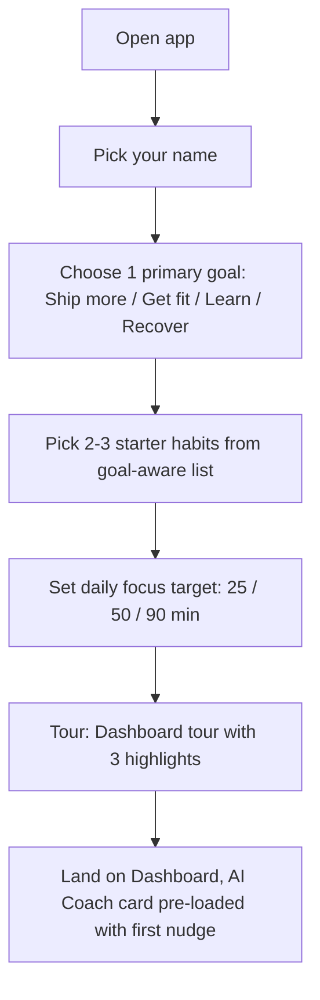
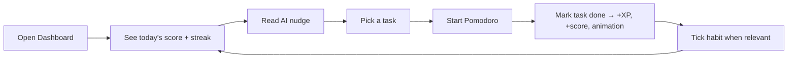
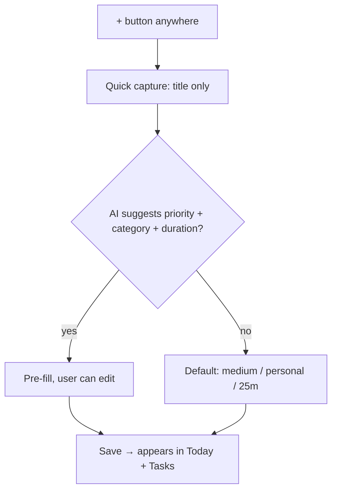
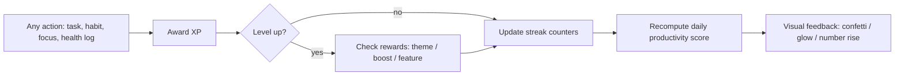
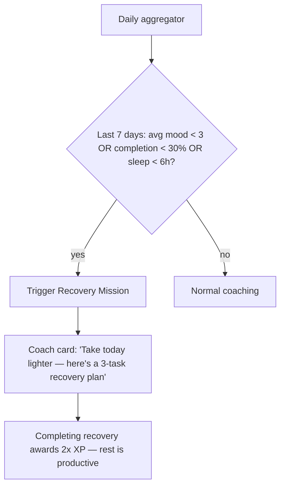
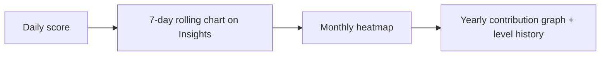

# App Flow

Textual flow diagrams. Render with Mermaid in any markdown viewer.

## 1. First-run onboarding (≤ 60s)


## 2. Daily core loop


## 3. Task creation


## 4. Gamification loop


## 5. AI suggestion loop
```mermaid
flowchart TD
  Trigger[Open Coach OR daily 8am cron] --> Gather[Gather: tasks, habits, focus, mood, energy]
  Gather --> Send[Send to Lovable AI Gateway / Gemini with tool schema]
  Send --> Parse[Parse structured response: headline, insights[], suggested_tasks[]]
  Parse --> Render[Render coach card + actionable buttons]
  Render --> Act{User accepts a suggestion?}
  Act -- yes --> Create[Create task / start focus / log mood]
  Act -- no --> Snooze[Snooze nudge, learn from rejection]
  Create --> Feedback[Feed outcome back into next prompt]
  Snooze --> Feedback
```

## 6. Burnout detection (Tier 2)


## 7. Progress analytics (daily → yearly)

