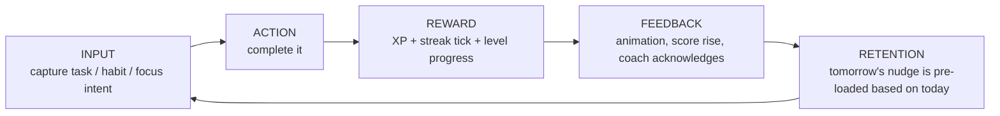

# The Core Loop

> One loop. Memorize it. Every feature either feeds it or gets cut.

```
INPUT  →  ACTION  →  REWARD  →  FEEDBACK  →  RETENTION
```

## The loop, expanded



Every screen in FlowSphere exists to **shorten one of these five arrows.**

---

## 1. INPUT — capture in under 5 seconds
- **Where:** `+` button on Dashboard, Tasks, Habits, BottomNav.
- **Rule:** Title-only is enough. Everything else (priority, category, duration) is AI-prefilled or defaulted.
- **Defaults:** `priority=medium · category=personal · durationMin=25`.
- **Failure to optimize this kills the loop.** If capture takes > 5s, users won't bother, and there's nothing for the rest of the loop to act on.

## 2. ACTION — complete with one tap
- **Where:** Checkbox on `TodayTasks`, habit chip on `HabitsStrip`, "End session" on Focus.
- **Rule:** Single tap. No confirmation modal. Undo via toast (5s window).
- **Latency budget:** state must update in < 50ms; the XP animation runs in parallel, never blocking.

## 3. REWARD — every action pays out, immediately
- XP awarded **synchronously** before the next paint.
- Streak counters tick **in the same transaction** (no flicker, no delay).
- The level bar moves visibly even for a 5-XP gain (use Framer Motion `layout` with a 350ms spring).
- Numbers are **the reward UI** — never abstract icons. Mono font, large, animated count-up.

## 4. FEEDBACK — sensory confirmation
| Action | Feedback |
|---|---|
| Complete a task | Checkbox fills (200ms), XP chip rises (+N), level bar advances |
| Hit a habit | Chip glows in habit color, streak number rolls |
| Finish a focus session | Ring completes, toast with XP, log appears in Insights |
| Level up | Full-screen confetti (one-shot), Coach posts a "level up" card |
| Unlock theme | Modal: "Aurora is yours" + "Apply now" CTA |

**Rule:** No silent state changes. Every reward gets a visual + (optional) sound.

## 5. RETENTION — tomorrow is pre-loaded today
- At end-of-day, the AI Coach pre-computes tomorrow's nudge from today's data.
- Habits show as "due today" chips first thing in the morning.
- The loop is closed by **opening the app and immediately seeing what to do** — never an empty state, never "set up your day".

---

## Anti-patterns we will not ship
- ❌ Setup wizards longer than 60 seconds
- ❌ Daily quotas the user must "fill" (creates pressure, kills retention after a miss)
- ❌ Modal blockers between action and reward
- ❌ Abstract progress (a moon filling, a tree growing) without a number — adults want numbers
- ❌ Push notifications more than 1× per day by default

---

## Skip behavior — what happens when the user disappears
| Time gone | App behavior |
|---|---|
| 1 day | Streaks unaffected if user has a freeze token. Coach welcomes them back. |
| 2–3 days | Freeze token consumed. Coach says: "Welcome back — let's pick one easy win." Suggests 1 low-priority task. |
| 4–7 days | Streaks reset. Longest-ever badge preserved. Coach proposes a Recovery Mission (3 small tasks, 2× XP). |
| 14+ days | Onboarding-lite: re-confirm the primary goal, refresh starter habits. Never delete data. |

**No XP decay. Ever.** Lost progress is the #1 reason productivity apps churn.

---

## Long-term retention hooks (the addictive layer, ethically)
1. **Compounding skill trees** — XP routes into Focus / Health / Learning / Craft. Branch levels unlock branch-specific perks. Users come back to "level up the branch they care about".
2. **Visible streak history** — the longest-ever streak is a permanent badge. Users protect it.
3. **Theme unlocks at L3 / L7 / L12** — far enough apart to matter, close enough to see.
4. **Weekly Coach review** — every Sunday, a personalized recap. The Coach remembering you is the moat.
5. **Dopamine Control mode** — opt-in cap to *prevent* over-engagement. Counterintuitively, this builds trust → users stay longer.

---

## How to debug a broken loop
If retention drops, walk the loop in order and ask:
1. Is INPUT taking > 5s? → simplify capture
2. Is ACTION blocked by a modal or confirmation? → remove it
3. Does REWARD feel real? → bigger number animation, more XP per action
4. Is FEEDBACK silent? → add motion + sound
5. Is RETENTION empty in the morning? → pre-load Coach + habits

**The loop is the product. Everything else is decoration.**
